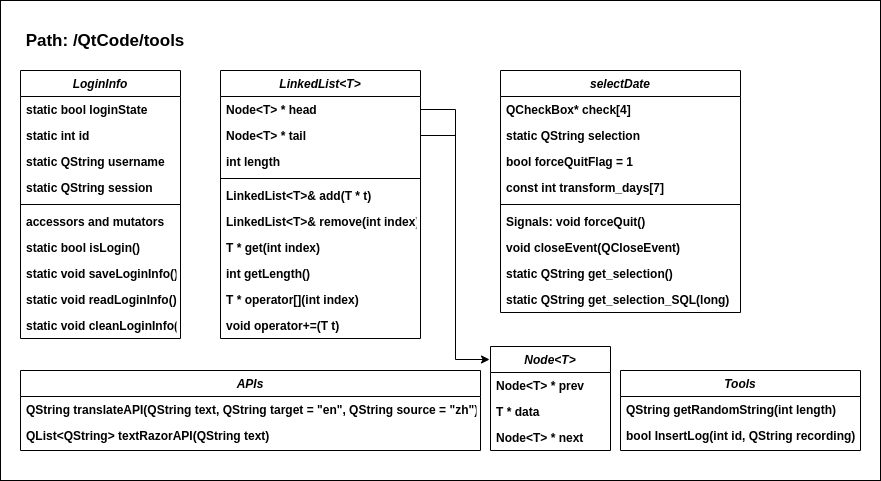
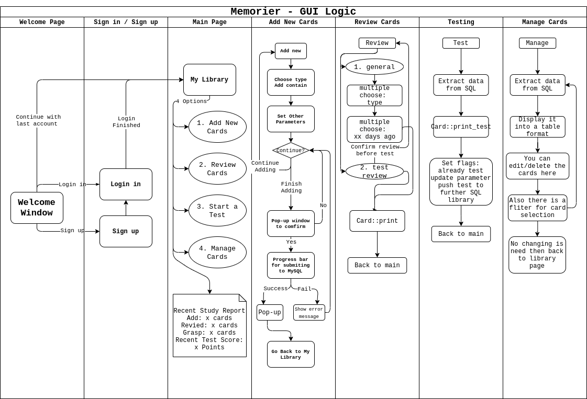

# Memoeier Documentation and Report
### Group: H20 
### Author: ZHANG Zhong & ZHANG Jiekai
- [0. Overview](#0-overview)        
  - [Our Objective](#our-objective) 
  - [The file struct and usage:](#the-file-struct-and-usage)    
- [1. Compile and run the progeam](#1-compile-and-run-the-progeam)    
- [2. How to use Memorier](#2-how-to-use-memorier)    
- [3. Class structure and functions](#3-class-structure-and-functions)        
  - [I. Card class and its drived classes](#i-card-class-and-its-drived-classes)        
  - [II. Tool classes](#ii-tool-classes)        
  - [III. GUI(Qt) classes and GUI login](#iii-guiqt-classes-and-gui-login)    
- [4. Brief description of program design](#4-brief-description-of-program-design)        
  - [I. Use of OOP constructs and techniques](#i-use-of-oop-constructs-and-techniques)        
  - [II. Use of Data Structures](#ii-use-of-data-structures)        
  - [III. Code Reusability](#iii-code-reusability)    
- [5. SQL data structure](#5-sql-data-structure)    
- [6. Future plan](#6-future-plan)
---

## 0. Overview
### Our Objective
#### **Memorier is a learning aid for you, which can help you remember and review better.**  
You can store knowledge in the form of **adding memory cards**, and Memorier will arrange regular **review and test** functions for you.  
The review and test of the cards is according to the **forgetting curve** to strengthen your memory of knowledge. Also, we support **custom review and test**. You can select the **type you want** and the **time period** for the creation of the card to generate a review and test sequence.  
In addition, all your cards will be **automatically synchronized** on your cloud account, which is convenient for multi-device switching.

### The file struct and usage:
.
├── doc
├── QtCode
│   ├── AddCard
│   ├── Cards
│   ├── CardTest
│   ├── libraryPage
│   │   └── images
│   ├── LoginAndMainpage
│   │   └── images
│   ├── ManageCard
│   ├── Review
│   └── tools
│       ├── APIs
│       ├── LinkedList
│       └── MySQL_API
└── release
    ├── linux
    └── windows

## 1. Compile and run the progeam
- You can directly use Qt to compile the code.
- But for runing the program, since we are using MySQL database in the code, please make sure that you have built the QMYSQL plugin. **There is no integrated support for MySQL plugin in Qt**, you need to download and compile the source code yourself.
- If you want to would like to know how to compile the MySQL plugin, click [HERE](https://www.codenong.com/cs106162868/) for Linux and [HERE](https://blog.csdn.net/liang19890820/article/details/105071549) for Windows

## 2. How to use Memorier
- Log in/Sign up your account (All your cards will be stored in cloud, so sign an account is a must)
- Add your card by cilck "**Add Card**" botton in the library page, there are 4 types of cards, we will explain each later.
- After adding the card you can "**Review**" them, either by their type or by the time you added it. (In the latter case, we will arrange the next review time according to the forgetting curve)
- The "**Test**" function is similar to review, but you need to answer the question in the card and we will record your score for future Review and Test
- In "**Management**" page you can delete or edit(later) your cards, there is a filter for searching cards.

## 3. Class structure and functions  
In the part we will go through all the important classes and functions used in our project.

### **I. Card class and its drived classes**
Class diagram:  
<!--  -->

* Base class: [Card](../QtCode/Cards/Card.h)  
The **Card** class provide a base class for other cards.  
It contains all the common data members of a class  
  > **Data members**:  
  > * id: the id in of a card in the database (also a unique identifier)  
  > * title: the title of a card  
  > * type: the type of a card (Plain text, Hollow text, Word, Mult choice)  
  > * problem: the problem body of card    
  > * review_times, ac_times: time of reviews and times of correctness in the test  
  > * lastime: last timestamp the card was reviewed   
  > * next_review: next timestamp the card will be reviewed  

  > **Member functions**:  
  > * accessors and mutators: gets and sets
  > * void test_update(int): update the data members after test  
  > * virtual QString option(int option, QString data): all the encoding and decoding functions (for storing/reading the data to/from database)  
  >   **option id list**:
  >   > * 1 - set answer for this card
  >   > * 2 - set special data for this card
  >   > * 3 - encode to store to database
  >   > * 4 - decode for read from database
  >   > * 5 - get answer for this card (pair with 1)
  >   > * 6 - Butshow text for review
  >   > * 7 - extra button for review
  >   > * 8 - extra output for review

* Drived class1: [Plain Text](../QtCode/Cards/Plain.h)  
The **Plain Text** is for storing a card with only problem and answer  
  > **Data members**:  
  > * ans: storing the answer of the card

  > **Member functions**:  
  > * virtual QString option(int option, QString data): same function as in the base class

* Drived class2: [Hollow Text](../QtCode/Cards/Text.h)  
The **Hollow Text** is for storing a "fill in the blank" card
  > **Data members**:  
  > * quiz: a vector with each element storing one of the "blank" of the text, contains the start and end index.
  > * hint: some hint of the answer
  > * prob_all: encoded problem (for storing in database)

  > **Member functions**:  
  > * virtual QString option(int option, QString data): same function as in the base class

* Drived class3: [Word](../QtCode/Cards/Word.h)  
The **Word** is a card used to recite words and can also do automatically translation  
  > **Data members**:  
  > * tran: storing the translation of the word

  > **Member functions**:  
  > * virtual QString option(int option, QString data): same function as in the base class

* Drived class4: [Mult Choices](../QtCode/Cards/Choices.h)  
The **Mult Choices** is for storing a card with only problem and answer  
  > **Data members**:  
  > * choice: a vector with each element storing one of the "Selection" of the problem  
  > * hint: some hint of the answer  

  > **Member functions**:  
  > * virtual QString option(int option, QString data): same function as in the base class

### **II. Tool classes**
Class/file diagram:  

* **[LoginInfo](../QtCode/tools/LoginInfo.h)**   
The **LoginInfo** class is used to store and read the login info of the user, it will generate a file .session for storing infomation to implement auto login.
  > **Our Login logic**:  
  > 1. **Sign up**: After the user input the password, we will first **generate a random salt** append to the password, and then use the **hash algorithm to encrypt** it. And sent the encrypted password and its salt to the database.
  > 2. **Login**: The program will fetch the **encrypted password and salt** from the database, and hash the password entered by the user append by salt. **If the password after hash is the same, then login success**.
  > 3. **When login success**: The program will **generate a session id and its corresponding expire time**, store it in the local ".session" file and also the database.
  > 4. **Auto Login**: When the next time user open the login window, the program will detect the local ".session" file and **compare it will the session id in the database**, if the **session is the same and not expired**, user can be auto login.  

  > **Data members**:  
  > * static bool loginState: a bool varible used to indicate the login state  
  > * static int id: user's id, used as a nnique identifier
  > * static QString username: username
  > * static QString session: session id

  > **Member functions**:  
  > * accessors and mutators: gets and sets
  > * static bool isLogin(): get login state
  > * static void saveLoginInfo(): save the login infomation to the local ".session" file
  > * static void readLoginInfo(): read the login infomation from the local ".session" file
  > * static void cleanLoginInfo(): clean ".session" file (used when session expired or the session id is not correct)

* **[LinkedList\<T>](../QtCode/tools/LoginInfo.h)**  
The **LinkedList\<T>** class is a template class of linked list, used to store our various data, such as cards and MySQL query datas
  > **Data members**:  
  > * Node\<T> * head: the head of the linked list
  > * Node\<T> * tail: the tail of the linked list
  > * int length: the length of the linked list

  > **Member functions**:  
  > * LinkedList\<T>& add(T * t): add a element to the tail (return reference for implementing cascading call)
  > * LinkedList\<T>& remove(int index): remove a specified element (return reference for implementing cascading call)
  > * T * get(int index): get a element by index
  > * int getLength(): get length of the linked list
  > * T * operator: operator overloading, get(index)
  > * void operator+=(T t): operator overloading, add(&t)

* **[APIs](../QtCode/tools/APIs/APIRequest.h)**  
There are two **APIs** we used in our project, one is [translate API](https://www.alapi.cn/doc/show/32.html), another is [keyword extraction API](https://www.textrazor.com/docs/rest).
  > **Functions**:  
  > * QString translateAPI(QString text, QString target = "en", QString source = "zh"): Call translation API, will be used when add/edit "word" type cards for auto translation  
  > * QList\<QString> textRazorAPI(QString text): Call the keyword extraction API, will be used when add/edit a "hollow text" type card for auto selecting keywords  

* **[tools](../QtCode/tools/tools.h)**  
Some commonly used **tools** in programs
  > **Functions**:  
  > * QString getRandomString(int length): generate a random string with certain length, will be used when generate salt and session  
  > * bool InsertLog(int id, QString recording): store the use log to the database, like, login, add card...
  >   > we have a sql table for storing users' log, all the login and card activities will be recorded for safety. For detial please refer to [5. SQL data structure](#5-sql-data-structure).  

### III. GUI(Qt) classes and GUI login
**Basic GUI logic:**  

**Class diagram:**  

The pages we use:
- Login page
- Library page
- Add page
- Review page
- Test page
- Manage page

## 4. Brief description of program design

### I. Use of OOP constructs and techniques

### II. Use of Data Structures

### III. Code Reusability

## 5. SQL data structure
**SQL structure diagram**:  

 - **account**: store the account infomation, the password here is encrypted. And the id is unique identifier of the user.
 - **account_log**: store the log of every user's activities, including login, add, delete, edit, review, test.
 - **account_session**: store the session id and its expire timestamp, used for auto login and security.
 - **card**: store all the card info and its attributes here.
## 6. Future plan
Yes, This Project Will Continue Even After the Project Period
-  Beautify the UI and add cutscenes or more animation
-  Add image uploading function in cloud server
-  Add setting page (User can config their review time and rules)
-  Ported to mobile phone program, Optimize the touch screen user experience
-  Add label feature to classify cards, let users label their cards for easy sorting and review

